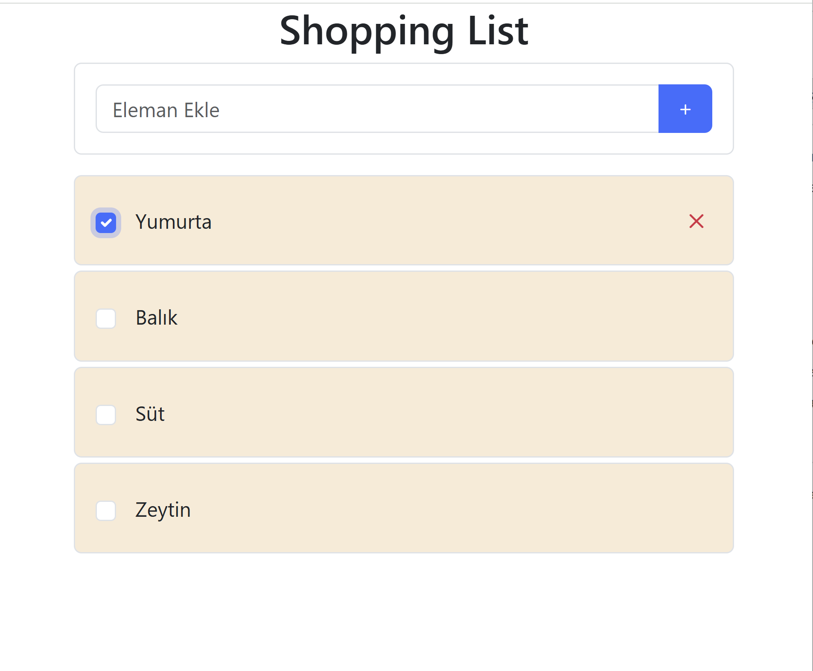

# 🛒 Shopping List

Kullanıcıların alışveriş listelerini **oluşturup yönetebileceği** sade ve **responsive** bir web uygulaması.

<p align="left">
  <a href="https://img.shields.io/badge/status-active-success">  </a>
  <a href="https://img.shields.io/badge/license-MIT-informational">  </a>
  <a href="https://img.shields.io/badge/tech-HTML5%20%7C%20CSS3%20%7C%20JavaScript-blue">  </a>
</p>

---

## 📷 Önizleme

<p align="center">
  
</p>

---

## ✨ Özellikler

- Ürün **ekleme** ve **silme**
- Ürünleri **tamamlandı** olarak işaretleme / geri alma
- Dinamik liste güncellemeleri (DOM manipülasyonu)
- **Local Storage** ile veri saklama (opsiyonel)
- **Mobil uyumlu** (responsive) arayüz

---

## 🛠️ Teknolojiler

- **HTML5**
- **CSS3**
- **JavaScript (Vanilla JS)**

---

## ⚙️ Kurulum ve Çalıştırma

```bash
# Depoyu klonla
git clone https://github.com/HilalOnler/shopping-list.git

# Klasöre gir
cd shopping-list

# Tarayıcıda aç (sadece index.html'i açman yeterli)
# Windows
start index.html
# macOS
open index.html
# Linux
xdg-open index.html
```

> Eğer Local Storage kullanıyorsanız farklı tarayıcı profillerinde test ederek verinin kalıcılığını doğrulayın.

---

## 🧭 Kullanım

1. Ürün adını yazın ve **Ekle**’ye tıklayın.
2. Ürün üzerine tıklayarak **tamamlandı** durumuna alabilir/geri çevirebilirsiniz.
3. Çöp kutusu ikonuyla ürünü **silebilirsiniz**.
4. (Opsiyonel) **Tümünü Temizle** butonu ile listeyi sıfırlayın.

---

## 🧩 Yol Haritası (Roadmap)

- [ ] Kategori / etiket desteği
- [ ] Arama / filtreleme
- [ ] Sürükle-bırak ile sıralama
- [ ] PWA (offline) desteği
- [ ] Çoklu dil

---

## 🌐 English (Short)

**Shopping List** is a simple, responsive web app to **create and manage** your shopping items.
It supports **add / remove**, **mark as completed**, optional **Local Storage**, and a clean UI built with **HTML, CSS, and Vanilla JS**.

---

## 🤝 Katkı (Contributing)

Öneriler ve katkılar memnuniyetle karşılanır! Lütfen bir **issue** açın veya **pull request** gönderin.

---

## 📄 Lisans

Bu proje **MIT** lisansı ile lisanslanmıştır. Ayrıntılar için `LICENSE` dosyasına bakın.
